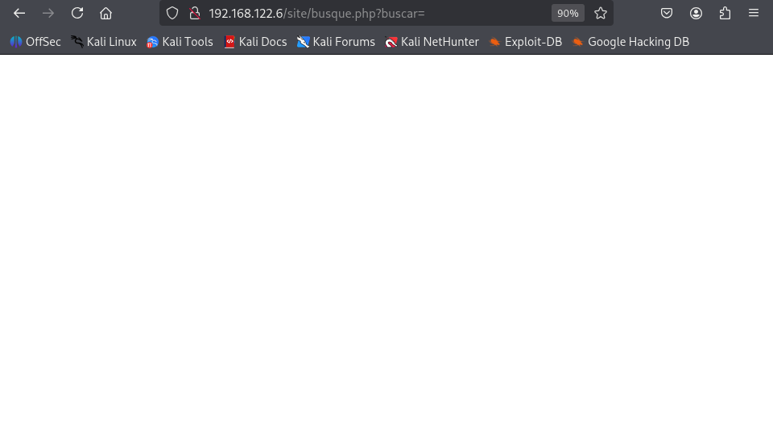
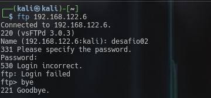

# Jangow1
## Box Description
Difficulty: easy

The secret to this box is enumeration! Inquiries jangow2021@gmail.com

This works better with VirtualBox rather than VMware ## Changelog 2021-11-04 - v1.0.1 2021-11-01 - v1.0.0

### Enumeration
Since its a vm, lets find the ip of the box in my network.
Lets use `arp-scan` to find it, and when we find it, lets do an nmap for it.
\
From this, we can see that `192.168.122.6` is indeed our vm and it has an `Apache` and `ftp`.\
First lets access the apache and see what it has to offer. And it seems that the home is in `site/`.
\
Now lets ffuf the dirs to see if there are any hidden dirs.
\
From this we can suspect that this is a wordpress made server.\
Now lets dig into the site a bit more. And in the nav-bar(menu), there are "About","Projects",and "Buscar"..... That felt off. So i googled it and sound that it meant search.\
Clicked it. Nothing popped up. \
\
But we can see that in the url... there is a possible attack vector. So lets play with it for a min and check if we can find anything.\
And BOOM!\
When i tried `whoami` in it, it popped `www-data`\
\
With this, we can understand that there is command injection vulnerability here.\
So lets dig more deeper to try and look for any creds to do ftp..\
lets first check the wordpress dir\
\
\
This gave me blank screen... i was stuck for a sec there and it was later it struck me that the config was php... So we have to check the source of this page.\
\
Which gave us important stuff... username:`desafio02` and password: `abygurl69`.\
When i tried logging into ftp with this cred... it didnt work.\
\
So lets dig more..\
I tried getting the etc\passwd and guess what...\
I got it...\
\
From this we can assume that our user foothold is probably `jangow01`\
So lets try with jangow and password from earlier on ftp.\
And it worked and we got the user flag.\
\

### Priv escalation
For priv escalation... lets try to look into the system a bit more..\
And while i was looking for something to exploit, i found the goldmine..\
\
the kernel version is outdated and there are multiple exploits present for privilege escalation.\
\
now after looking in exploit db, i downloaded a "dirtycow" exploit and copied it to the vm.\
\
NB: It should be possible to use other exploits and get the root as well.\
\
\
Since there i couldnt find any way to get any proper shell, i assumed that it was most likely set that way. So i directly logged in the vm and compiled the exploit.\
\
Then I executed it and BOOM got the root... sometimes it crashes fast so, run
```bash
echo 0 > /proc/sys/vm/dirty_writeback_centisecs
```
for a bit more stable system after rooting.\
Since I have the root, i printed the `proof.txt` flag\

## Conclusion
| Step                           | Insight                                                                                                       |
| ------------------------------ | ------------------------------------------------------------------------------------------------------------- |
| Enumeration is king            | Starting with minimal visibility—web server & FTP turned a hidden injection into full user compromise.    |
| Code injection → creds → shell | Command injection turned into usable credentials for FTP, which enabled resource upload and exploit delivery. |
| Dirty COW still deadly         | The Dirty COW kernel exploit remains a potent local privilege escalation method—even on legacy kernels.       |
| FTP is your friend             | FTP enabled me to transfer binaries/PoCs mid-exploit, bypassing web upload limitations.                      |

---
#### Note
After completing the box, i went and searched for other writeups and found that others also use the VM directly.. So i think it is safe to assume that it was meant to be that way.
- Another one down, more to go🎯.